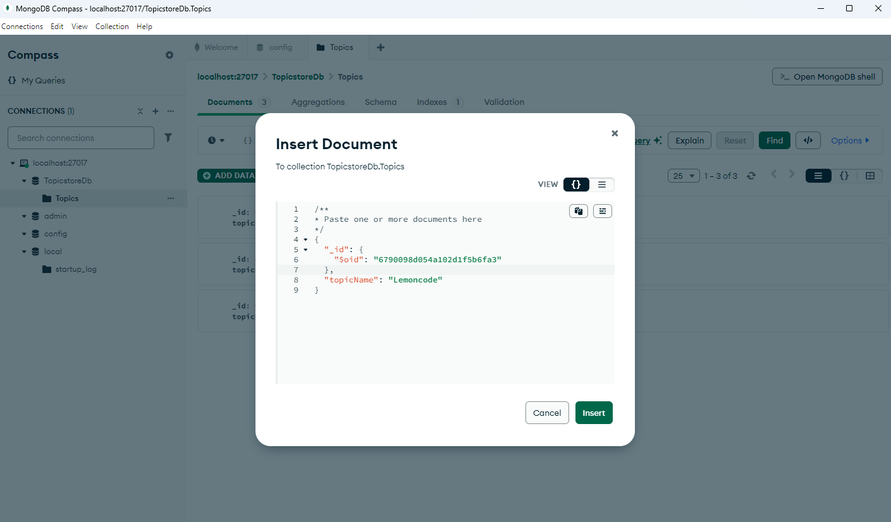
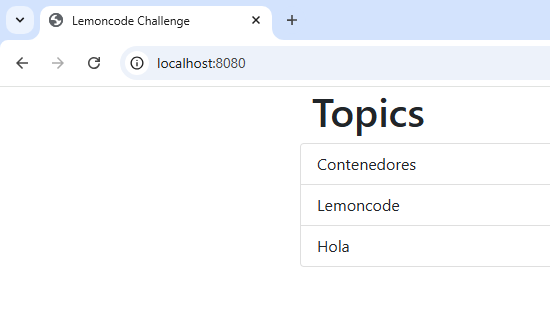

1. Creación de la red y del volumen para mongo
```bash
    docker network create lemoncode-challenge
    docker volume create db_data
```
2. Iniciar el contenedor de MongoDB, inicialmente con port mapping para acceder desde MongoDB Compass y añadir datos en `TopicstoreDb`
```bash
    docker run -d --rm --name some-mongo \
      --network lemoncode-challenge \
      -v db_data:/data/db \
      -p 27017:27017 \
      mongo:latest
```



3. Una vez introducidos, nuevo contenedor sin port mapping
```bash
    docker stop some-mongo

    docker run -d --rm --name some-mongo \
    --network lemoncode-challenge \
    -v db_data:/data/db \
    mongo:latest
```
4. Build del backend ([Dockerfile](backend/Dockerfile)) y creación del contenedor con el archivo [.env](backend/.env)
```bash
    docker build -t node-backend ./backend

    docker run -d --rm --name topics-api \
      --network lemoncode-challenge \
      --env-file ./backend/.env \
      node-backend
```

5. Build del frontend ([Dockerfile](frontend/Dockerfile)) y levantar el contenedor
```bash
    docker build -t node-frontend ./frontend

    docker run -d --rm --name topics \
      --network lemoncode-challenge \
      -p 8080:3000 \
      -e API_URI="http://topics-api:5000/api/topics" \
      node-frontend
```

Resultado: 
